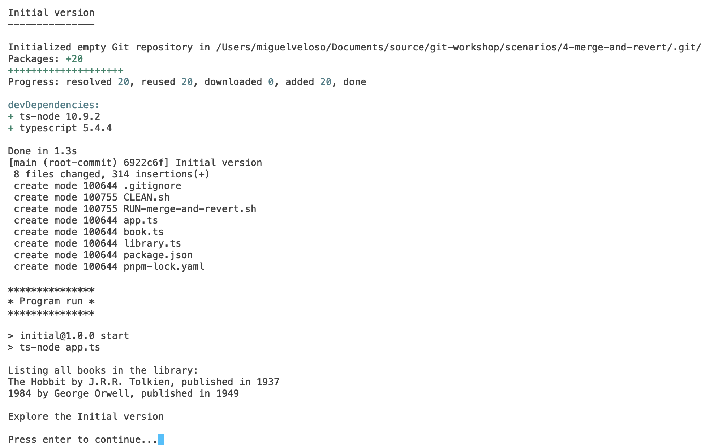

# Git Workshop

This is a repo to showcase the scenario of "disappearing" updates in git

## Content

- A `scripts` folder for... you can guess... (Mac OS, Linux)
- A `scenarios` folder for, well, the scenarios
- A `code` folder that contains the code changes used in the scenarios

## Quick run

1. Run the `chmod+x.sh` to give execute permission to all scripts. (You'll have to give execute permission to this one first yourself, of course.)
2. Go to the `scripts` folder
3. Run `source set-path.sh` to add the scripts folder to the PATH for the session.
4. Go the `scenarios/4-merge-and-revert` folder
5. Run the `./CLEAN.sh` script to get a clean start.
6. Run the `./RUN-merge-and-revert.sh` and follow the prompts

## Troubleshooting

If you don't get something like this when running step 6 above:

It's probable that:

- The scripts don't have execute permission (step 1 above)
- The `scripts` folder isn't in the current PATH (step 3 above)
